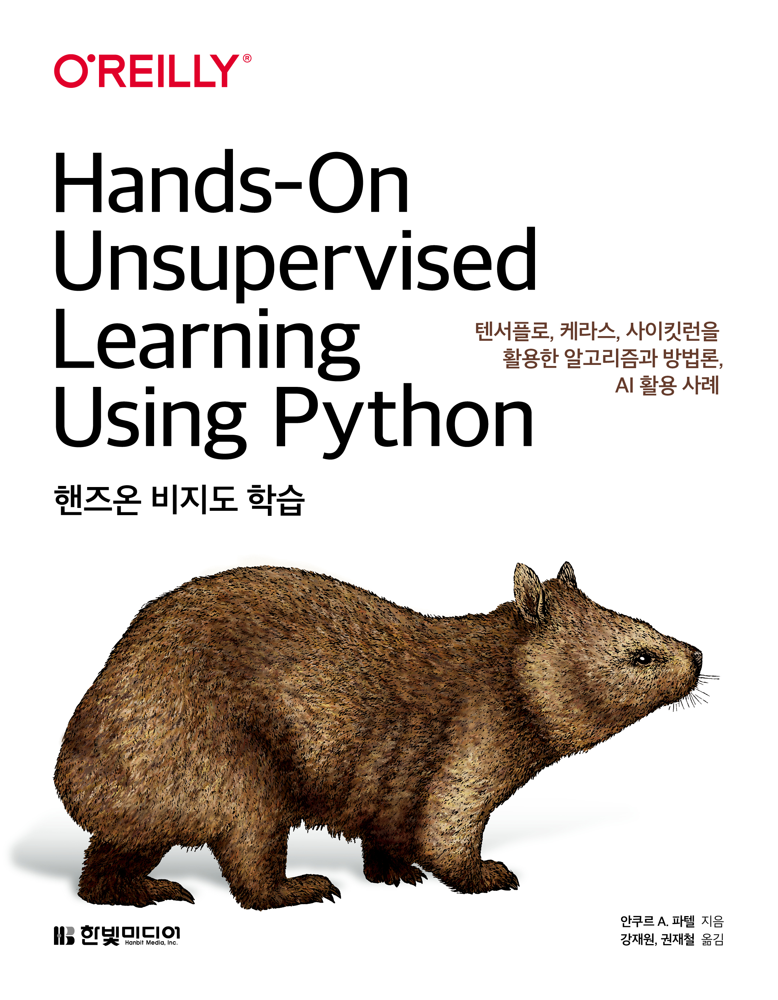

# 핸즈온 비지도 학습
도서 "핸즈온 비지도 학습 - 텐서플로, 케라스, 사이킷런을 활용한 알고리즘과 방법론, AI 활용 사례"의 코드 저장소입니다.

이 책은 다음의 서점에서 판매 중입니다. [Yes24](http://www.yes24.com/Product/Goods/91119565?scode=032&OzSrank=1), [한빛미디어](https://www.hanbit.co.kr/store/books/look.php?p_code=B7126889829), [교보문고](http://www.kyobobook.co.kr/product/detailViewKor.laf?ejkGb=KOR&mallGb=KOR&barcode=9791162243190&orderClick=LAG&Kc=&fbclid=IwAR1CbQBAfnw76-6LX_rFTRgadSQCwWwULldhipOouG-idm_1BA75FDAWQc0), [알라딘](https://www.aladin.co.kr/shop/wproduct.aspx?ItemId=246161094&start=slayer&fbclid=IwAR2HBUHnyOi_ImL5R2hd-LtBzrJ56Il4u98R_yhIoSJyVOLGbgO6rroCQwc), [인터파크](http://shopping.interpark.com/product/productInfo.do?prdNo=7337968038&dispNo=008001082&pis1=shop&pis2=product&fbclid=IwAR2cdy7qZenlM0W0V5vC1szWHgXMW5vAE3zzkEVpF1jwLXlIq_ZXKZqvPDM)

## 도서 소개
많은 업계 전문가들은 인공지능 연구의 궁극적인 목표인 이른바 일반 인공지능 (GAI, General Artificial Intelligence)을 구현하기 위해서 필요한 핵심 기술로 비지도 학습 (Unsupervised Learning)을 꼽습니다. 왜냐하면 대부분의 현실 세계 데이터에는 레이블이 없기 때문에 기존의 지도 학습 기법을 적용할 수 없기 때문입니다. 비지도 학습을 레이블이 없는 데이터셋에 적용하면 인간이 발견하기 거의 불가능한 패턴이나 데이터 깊이 묻혀 있는 의미 있는 패턴을 발견할 수 있습니다.

이 책의 저자인 앵쿠르 파텔 (Ankur Patel)은 두 가지의 간단하면서 프로덕션 환경에 적합한 파이썬 프레임워크인 사이킷런 (scikit-learn)과 케라스 (Keras)를 활용한 텐서플로우 (TensorFlow)를 사용하여 비지도 학습을 적용하는 방법에 대한 실전적인 지식을 전달합니다. 또한 다양한 실습 예제와 코드를 통해, 데이터에 내재된 패턴을 찾아내어 깊이 있는 비즈니스 통찰력을 얻거나, 이상 징후를 감지하고, 자동화된 피쳐 엔지니어링 및 피쳐 선택을 수행하고, 새로운 합성 데이터셋을 생성할 수 있을 것입니다. 여러분들은 약간의 머신러닝 경험과 프로그래밍 스킬만 준비하면 됩니다.

- 다양한 머신러닝 접근 방법들의 장단점 비교 : 지도학습, 비지도 학습, 그리고 강화 학습
- 전반적인 머신러닝 프로젝트 설정 및 관리 – 데이터 수집부터 모델 생성 및 운영환경에서의 솔루션 구현까지의 모든 것
- 차원 감소 알고리즘을 사용하여 데이터에서 가장 관련성 높은 정보를 찾아내어 신용카드 사기를 탐지하기 위한 이상 탐지 시스템을 구축
- 군집화 알고리즘을 사용하여 사용자를 (대출)채무자와 같이 고유하고 동질적인 그룹으로 분류
- 자동 피쳐 엔지니어링 및 피쳐 선택을 수행하기 위해 오토인코더 (autoencoder)를 사용
- 준 지도 학습 솔루션을 개발하기 위해 지도 및 비지도 학습 알고리즘을 결합
- 제한된 볼츠만 머신을 사용하여 영화 추천 시스템 구축
- 생성적 적대 신경망 (GAN)과 심층 신뢰 신경망 (DBN)을 사용한 합성 이미지 생성
- 심전도와 같은 시계열 데이터에 대한 군집화 수행
- 최신 비지도 학습 성공 사례 및 향 후 전망에 대한 탐색

## 실습 데이터 셋 다운로드 경로 및 참고 사항
아래 표는 번역서 내용에 포함된 실습 데이터셋, 다운로드 경로 및 참고 사항입니다. 실습 코드를 실행을 위해 데이터 셋 다운로드시 참고하시기 바랍니다.

|&nbsp;&nbsp;&nbsp;&nbsp;&nbsp;&nbsp;&nbsp;&nbsp;&nbsp;  활용 Chapter	| &nbsp;&nbsp;&nbsp;&nbsp;&nbsp;&nbsp;&nbsp;&nbsp;&nbsp;  실습 Data| &nbsp;&nbsp;&nbsp;&nbsp;&nbsp;&nbsp;&nbsp;&nbsp;&nbsp;  다운로드 방식|&nbsp;&nbsp;&nbsp;&nbsp;&nbsp;&nbsp;&nbsp;&nbsp;&nbsp;&nbsp;&nbsp;&nbsp;&nbsp;&nbsp;&nbsp;&nbsp;&nbsp;&nbsp; 파일경로|&nbsp;&nbsp;&nbsp;&nbsp;&nbsp;&nbsp;&nbsp;&nbsp;&nbsp;  파일 크기| 참고사항|
|:-----:|:-----:|:-----:|:-----:|:-----:|----------------|
|2장 4장 8장 9장|신용카드 거래 Data|Github|경로링크: [[신용카드]](https://github.com/francis-kang/handson-unsupervised-learning/blob/master/datasets/credit_card_data/credit_card.csv) |144MB|신용카드 거래 데이터 셋의 데이터 용량은 144MB이고 깃허브에 올려져 있습니다. 이 데이터셋은 100MB가 넘는 데이셋으로 깃허브 웹에서 데이터 보기(view) 및 다운로드 버튼으로 데이터를 보거나 다운로드 할 수 없으며, 깃저장소 기능인 LFS를 사용해야합니다.   이와 관련한 설명이 번역서 70페이지에  나와있습니다.  [관련 내용]  $ git clone https://github.com/francis-kang/handson-unsupervised-learning.git  $ git lfs pull  옮긴이_ LFS란 Large File Storage를 뜻하고 대용량 파일을 관리하는 깃 저장소입니다. 대용량 파일을 복제하기 위해서는 LFS를 로컬 컴퓨터에 설치한 후 리포지터리를 복제해야 파일이 잘 복제됩니다. LFS를 설치하지 않고 리포지터리를 복제할 경우 일부 파일이 복제되지 않습니다. git LFS 설치 파일 다운로드 경로는 다음과 같습니다. https://git-lfs.github.com      이 데이터 셋은 웹 사이트에서도 다운로드 받을 수 있습니다.   이와 관련된 설명은 번역서 74페이지에 있습니다.   [관련 내용]  이 데이터셋은 캐글(https://www.kaggle.com/mlg-ulb/creditcardfraud)을 통해 구할 수 있으며, Worldline과 University of Libre de Bruxelles의 머신러닝 그룹이 공동 연구를 진행하면서 수집했습니다. 자세한 정보는 다음 자료를 참고하십시오. Andrea Dal Pozzolo, Olivier Caelen, Reid A. Johnson and Gianluca Bontempi, 「Calibrating Probability with Undersampling for Unbalanced Classification」 in Symposium on Computational Intelligence and Data Mining(CIDM), IEEE, 2015"|
|3장 5장 11장 12장|	MNIST Data|Github|경로링크: [[MNIST]](https://github.com/francis-kang/handson-unsupervised-learning/blob/master/datasets/mnist_data/mnist.pkl.gz)|	15MB||
|6장|	랜딩클럽 대출 Data|Github|경로링크: [[랜딩클럽]](https://github.com/francis-kang/handson-unsupervised-learning/blob/master/datasets/lending_club_data/LoanStats3a.csv)|	28MB|	
|10장|	무비렌즈 Data|Web|경로링크: [[무비렌즈]](https://grouplens.org/datasets/movielens/20m/)|	190MB|	무비렌즈 웹 사이트 https://grouplens.org/datasets/movielens/20m/ 에서 직접 파일을 다운로드해야 합니다.|
|13장|	UCR 시계열 컬렉션 Data|Web|경로링크: [[UCR]](https://www.cs.ucr.edu/~eamonn/time_series_data/)|	350MB|	UCR 시계열 웹 사이트 https://www.cs.ucr.edu/~eamonn/time_series_data/ 에서  파일을 다운로드해야 합니다. 웹페이지 방문 후 다음 문장 "Then you can download the entire archive " 의 링크를 들어가시거나 다음 URL https://www.cs.ucr.edu/~eamonn/time_series_data/UCR_TS_Archive_2015.zip 로 들어가면 다운로드를 받을 수 있습니다. 압축 데이터 풀기할때 비밀번호는 attempttoclassify 입니다.|

## 번역서 내 주석 및 참고URL 목록
아래 표는 번역서 내용에 포함된 주석과 참고 URL 목록입니다. 참고 사이트 방문 시 활용하세요.

### CHAPTER 0 서문
page|주석 혹은 본문 내용[URL]
-----|-----
|30p|옮긴이_ 하이프 사이클(hype cycle)은 기술의 성숙도를 표현하기 위한 시각적 도구입니다. 과대광고 주기라고도 합니다. 미국의 정보 기술 연구 및 자문 회사인 가트너에서 개발했습니다.[https://ko.wikipedia.org/wiki/%ED%95%98%EC%9D%B4%ED%94%84_%EC%82%AC%EC%9D%B4%ED%81%B4]|

### CHAPTER 1 머신러닝 생태계와 비지도학습
page|주석 혹은 본문 내용[URL]
-----|-----
|44P|옮긴이_ 표현학습[representation learning)은 피처학습(feature representation learning)이라고도 하며 원본 데이터의 형상을 학습하여 분석 목적에 적합한 유용한 정보를 추출하거나 파생하는 머신러닝 기법입니다.[https://en.wikipedia.org/wiki/Feature_learning]|
|45P|Figure Eight [https://www.figure-eight.com/] 처럼, 데이터에 레이블을 지정하는 수작업을 머신러닝 기법으로 기계가 대신 해주는 서비스를 제공하는 스타트업도 있습니다.|
|48P|옮긴이_ 가치 함수(value function)는 일반적으로 강화학습에서 많이 사용되는 용어이며, 어떤 상태에 따라 앞으로 얼마의 보상을 받을수 있을지에 대한 기댓값으로 정의될 수 있습니다. 여기에서 가치 함수는 앞에서 언급한 것처럼 스팸 메일 필터 문제에서 정확하게 분류된 이메일의 비율을 예로 들 수 있습니다.[https://minhobby.tistory.com/37]|
|53P|옮긴이_ 배깅은 원자료(raw data)로부터 여러 샘플 데이터(bootstrap sample)를 생성, 각 샘플 데이터를 모델링(modeling)한 후 결과를 집계(aggregating)하여 최종 예측 모델을 산출하는 방법입니다. 원자료로부터 여러 번 복원 샘플링(random sampling)하여 생성한, 크기가 동일한 여러 샘플을 사용하여 모델링함으로써 과대 적합을 피하고 예측 모델의 분산을 줄여 예측력을 향상시키는 일종의 앙상블 학습법의 메타 알고리즘이라고 할 수 있습니다.[https://ko.wikipedia.org/wiki/%EB%B0%B0%EA%B9%85]|
|53P|머신러닝 경진 대회에 그래디언트 부스팅 머신을 사용하는 것을 더 알고 싶다면 Ben Gorman의 블로그 게시물을 참조하십시오.[https://medium.com/kaggle-blog]|
|54P|신경망을 더 알고 싶으면 Ian Goodfellow, Yoshua Bengio, Aaron Courville의 Deep Learning을 확인하십시오(MIT Press).[http://www.deeplearningbook.org]|
|56P|옮긴이_ 선형대수에서 행렬의 차원을 Rank로 표현하며, 행렬의 열들로 생성될 수 있는 벡터 공간의 차원을 의미합니다.[https://en.wikipedia.org/wiki/Rank_(linear_algebra)]|
|65P|옮긴이_ 아타리(atari)는 1972년에 설립한 비디오 게임 회사 이름이자 이 회사에서 개발한 비디오 게임(스페이스 인베이더, 팩맨 등)을 말합니다. 딥마인드가 심층 강화학습을 처음 적용한 아타리 게임은 ‘스페이스 인베이더’로 알려졌습니다.[https://ko.wikipedia.org/wiki/%EC%95%84%ED%83%80%EB%A6%AC]|

### CHAPTER 2 머신러닝 프로젝트 A to Z
page|주석 혹은 본문 내용[URL]
-----|-----
|69P|아직 Git [https://git-scm.com] 을 설치하지 않았다면 Git을 설치해야 합니다. Git은 코드를 위한 버전 관리 시스템이며, 이 책의 모든 코딩 예제는 깃허브 리포지토리[https://github.com/aapatel09/handson-unsupervised-learning] 에서 가져와 주피터 노트북으로 이용할 수 있습니다.|
|70P|로저 더들러의 깃 가이드[http://rogerdudler.github.io/git-guide] 를 살펴보고 리포지토리를 복제하고 변경 사항을 추가, 커밋 및 푸시하고 브랜치를 사용하여 버전 관리를 유지하는 방법을 알아보십시오.|
|70P|다음 프롬프트를 사용하여 깃허브에서 이 책과 관련된 리포지토리를 복제하십시오. 또는 깃허브의 리포지토리[https://github.com/aapatel09/handson-unsupervisedlearning] 를 방문하여 리포지토리를 수동 다운로드하여 사용할 수 있습니다.|
|70P|옮긴이_ LFS란 Large File Storage를 뜻하고 대용량 파일을 관리하는 Git 저장소입니다. 대용량 파일을 복제하기 위해서는 LFS를 로컬 컴퓨터에 설치한 후 리포지토리를 복제해야 파일이 잘 복제됩니다. LFS를 설치하지 않고 리포지토리를 복제할 경우 일부 파일이 복제되지 않습니다. git LFS 설치 파일 다운로드 경로는 다음과 같습니다.[https://git-lfs.github.com]|
|71P|파이썬과 머신러닝에 필요한 데이터 과학 라이브러리를 설치하려면 파이썬의 아나콘다 배포판[https://www.anaconda.com/distribution] 을 다운로드 하십시오.|
|72P|시스템의 32비트 또는 64비트 버전에 따라 자신의 시스템에 맞는 버전의 XGBoost [https://www.lfd.uci.edu/~gohlke/pythonlibs/#xgboost] 를 다운로드해야합니다.|
|73P|fastcluster에 대한 자세한 정보는 [https://pypi.org/project/fastcluster/] 를 참조하십시오.|
|73P|옮긴이_ fastcluster 설치 중 다음과 같은 에러 메시지가 나타날 경우 Visual C++ 빌드 도구를 설치해야 합니다. error: Microsoft Visual C++ 14.0 is required. Get it with "Microsoft Visual C++ Build Tools": https://visualstudio.microsoft.com/downloads/ Visual C++ 빌드 도구 설치를 위해서 에러 메시지에 있는 사이트에 접속 후 Visual Studio Community 버전을 다운로드 후 실행하여 Visual C++ 빌드 도구만 설치합니다.|
|74P|이 데이터 셋은 캐글[https://www.kaggle.com/mlg-ulb/creditcardfraud]을 통해 구할 수 있으며, Worldline과 University of Libre de Bruxelles의 머신러닝 그룹이 공동 연구를 진행하면서 수집한 겁니다. 자세한 정보는 Andrea Dal Pozzolo, Olivier Caelen, Reid A. Johnson and Gianluca Bontempi, “Calibrating Probability with Undersampling for Unbalanced Classification” in Symposium on Computational Intelligence and Data Mining(CIDM], IEEE, 2015을 참조하십시오.|
|78P|옮긴이_ 이진 분류에서 두 클래스는 포지티브 및 네거티브 레이블로 구분합니다. 모델을 생성하는 목적은 포지티브 레이블 결과를 찾는 겁니다. 사기 탐지 모델에서 포지티브 레이블은 '사기'를 의미합니다.[https://developers.google.com/machine-learning/glossary?hl=ko#p]|
|79P|옮긴이_ 희소 행렬은 행렬 값이 대부분 0인 경우를 가리키는 표현으로 범주형 변수를 더미 변수(1과 0의 값을 가지는 변수]로 변환한 행렬을 이야기합니다. 원-핫 인코딩과 동일한 의미를 가집니다.[https://ko.wikipedia.org/wiki/%ED%9D%AC%EC%86%8C%ED%96%89%EB%A0%AC]|
|85P|옮긴이_ 층화매개변수는 층화 추출 방식으로 데이터 샘플링하기 위해 지정하는 기준 변수를 말합니다. 모집단의 해당 기준 변수 비율에 맞추어 데이터를 표본 추출하여, 샘플 데이터의 특성 분포를 모집단과 유사하게 맞추기 위해 사용합니다.[https://en.wikipedia.org/wiki/Stratified_sampling]|
|85P|옮긴이_ 랜덤 시드를 의미합니다. 난수 생성 함수는 시드를 기반으로 난수를 발생시키고 시드가 동일하면 동일한 난수를 발생시키게 됩니다. 파이썬 코드상 용어(random state)를 살려서 랜덤 상태로 번역했습니다. [https://en.wikipedia.org/wiki/Random_seed]|
|85P|층화매개변수가 포지티브 레이블의 비율을 유지하는 방법을 자세히 알고 싶으면 공식 웹 사이트를 방문하십시오.[https://scikit-learn.org/stable/modules/generated/sklearn.model_selection.train_test_split.html] 실험에서 동일한 분할을 재현하려면 랜덤 상태를 2018로 설정합니다. 이것을 다른 숫자로 설정하거나 아무것도 설정하지 않으면 결과가 달라집니다.|
|87P|L1과 L2에 대한 자세한 정보는“Differences Between L1 and L2 as Loss Function and Regularization.” 블로그 포스트를 참조하십시오. [http://www.chioka.in/differences-between-l1-and-l2-as-loss-function-and-regularization/]|
|88P|옮긴이_ solver 매개변수는 최적화에 사용되는 해 찾기 알고리즘을 지정합니다. Solver를 자세히 알고 싶으면 다음 웹 사이트를 방문하십시오. [https://scikit-learn.org/stable/modules/generated/sklearn.linear_model.LogisticRegression.html]|
|94P|옮긴이_ ROC(수신자 조작 특성 또는 반응자 작용 특성) 곡선은 일반적으로 이진 분류기에 대한 성능을 평가하는 기법입니다. 참 양성 비율(true positive rate, Y축, 민감성) 대 거짓 양성 비율(false positive rate, X축, 1-특이성)을 그래프로 나타냅니다. 신호 탐지 이론에서 가져온 개념으로 세계전쟁 당시 통신에서 사용한 용어(예: 리시버)를 사용합니다. [https://en.wikipedia.org/wiki/Receiver_operating_characteristic]|
|100P|XGBoost 그래디언트 부스팅에 대한 더 자세한 내용은 GitHub 리포지토리를 참조하십시오.[https://github.com/dmlc/xgboost]|
|100P|옮긴이_ 학습률은 최적화 알고리즘의 매개변수이며. 작은 값을 가지면 더 견고한 모델이 만들어 질 수 있지만 수행시간이 오래 걸립니다. 큰 값을 가지면 수행시간은 짧지만 최적 해를 찾지 못할 수도 있습니다. [https://en.wikipedia.org/wiki/Learning_rate]|
|104P|마이크로소프트사의 LightGBM 그래디언트 부스팅을 더 알고 싶으면 다음 링크를 참조하십시오.[https://github.com/Microsoft/LightGBM]|
|107P|머신러닝 솔루션의 결과를 개선하고 과소 적합/과대 적합을 해결하기 위해 하이퍼파라미터(하이퍼파라미터 파인튜닝fine-tuning22이라고 알려진 프로세스)를 조정하는 방법을 살펴보지 않았지만 깃허브 코드[https://github.com/aapatel09/handson-unsupervised-learning]를 통해 이러한 실험을 매우 쉽게 수행할 수 있습니다.|
|113P|앙상블 학습에 대한 더 자세한 내용은 다음 세 링크를 참고하십시오. Kaggle Ensembling Guide[https://mlwave.com/kaggle-ensembling-guide] Introduction to Ensembling/Stacking in Python[https://www.kaggle.com/arthurtok/introduction-to-ensembling-stacking-in-python] A Kaggler’s Guide to Model Stacking in Practice[http://blog.kaggle.com/2016/12/27/a-kagglers-guide-to-model-stacking-in-practice]|

### CHAPTER 3 차원 축소
page|주석 혹은 본문 내용[URL]
-----|-----
|124P|옮긴이_미국 국립 표준 기술 연구소(NIST)의 원본 데이터 셋의 샘플을 재혼합하고, 머신러닝 알고리즘을 용이하게 적용하기 위해 전처리를 거친 데이터라는 의미에서 앞에 M(mixed or remix)을 붙여 MNIST라고 합니다.[https://en.wikipedia.org/wiki/MNIST_database]|
|124P|얀 르쿤의 웹사이트에서 제공하는 MNIST 손으로 쓴 숫자 데이터 셋입니다.[http://yann.lecun.com/exdb/mnist/]|
|124P|Deeplearning.net 웹사이트에서 제공하는 MNIST 데이터 셋의 피클 버전입니다.[http://deeplearning.net/tutorial/gettingstarted.html]|
|137P|옮긴이_ 일반적으로 머신러닝에서 희소라는 표현은 값이 대부분 0인 경우의 행렬이나 데이터를 말합니다. 희소성 있는 데이터는 알고리즘에 성능을 저하시키기 때문에 대부분 희소성을 제거하는 기법을 사용하지만 일부 문제에서는 희소성을 어느 정도 유지하는 것이 도움이 되기도 합니다. 희소성을 어느 정도 유지하게 되면 자료 해석의 용이함, 변수 선택 효과, 과대 적합 방지에 도움이 될 수 있습니다.[https://ko.wikipedia.org/wiki/%ED%9D%AC%EC%86%8C%ED%96%89%EB%A0%AC]|
|142P|옮긴이_ 보조정리(lemma)는 수학에서 이미 증명된 명제로서 그 자체가 중시되기보다는 다른 더 중대한 결과를 증명하는 디딤돌로 사용되는 명제입니다. JL lemma를 더 알고 싶다면 다음을 참조하십시오.[https://en.wikipedia.org/wiki/Johnson%E2%80%93Lindenstrauss_lemma]|
|143P|옮긴이_ 입실론은 0에서 1 사이의 값을 가지며 사이킷런에서 제공하는 GaussianRandomProjection 함수의 n_components 파라미터가 ‘auto’로 되었을 때 사용하며, 작은 값을 가질수록 더 나은 임베딩과 고차원의 주성분 수가 생깁니다.[https://scikit-learn.org/stable/modules/generated/sklearn.random_projection.GaussianRandomProjection.html]|
|146P|옮긴이_ 매니폴드는 국소적으로 유클리드 공간과 닮은 위상 공간입니다. 즉 두 점 사이의 거리 혹은 유사도가 근거리에서는 유클리디안 거리(Euclidean metric, 직선 거리)를 따르지만 원거리에서는 그렇지 않은 공간을 말합니다. [https://ko.wikipedia.org/wiki/%EB%8B%A4%EC%96%91%EC%B2%B4]|

### CHAPTER 4 이상치 탐지
page|주석 혹은 본문 내용[URL]
-----|-----
|168P|옮긴이_ 알파 파라미터의 값이 클수록 더 희소한 주성분을 생성합니다.[https://scikit-learn.org/stable/modules/generated/sklearn.decomposition.SparsePCA.html]|
|169P|옮긴이_ 일반적으로 PCA에서 주성분을 생성할 때 평균 빼기(혹은 평균 중심화)를 가장 먼저 진행합니다. 따라서 PCA 역변환에서는 마지막에 평균을 더해줘야 합니다.[https://ko.wikipedia.org/wiki/%EC%A3%BC%EC%84%B1%EB%B6%84_%EB%B6%84%EC%84%9D]|
|178P|옮긴이_ 과소완전 사전은 실제 입력 데이터가 저차원 공간에 있는 설정을 나타냅니다. 완전한 사전은 표현적 관점에서 어떠한 개선도 제공하지 않습니다. 앞에서 원본 차원과 동일한 주성분의 수를 생성하는 것은 이상 탐지에서 의미가 없다는 개념과 동일합니다. [https://en.wikipedia.org/wiki/Sparse_dictionary_learning]|

### CHAPTER 5 클러스터링 
page|주석 혹은 본문 내용[URL]
-----|-----
|202P|fastcluster에 대한 자세한 내용은 해당 프로젝트 웹 페이지를 확인하십시오.[https://pypi.org/project/fastcluster]|
|203P|여기서 ward는 와드의 최소 분산 방법Ward’s minimum variance method을 의미합니다. 이 방법을 더 알아보려면 온라인 링크[https://en.wikipedia.org/wiki/Ward's_method] 를 참조하세요.|
|211P|옮긴이_ 롱테일(long tail)은 파레토 법칙을 그래프에 나타냈을 때 기하 급수적으로 줄어들며 꼬리처럼 긴 모양을 형성하는 나머지 20%를 말합니다. [https://ko.wikipedia.org/wiki/%EA%B8%B4_%EA%BC%AC%EB%A6%AC]|

### CHAPTER 6 그룹 세분화 
page|주석 혹은 본문 내용[URL]
-----|-----
|216P|옮긴이_ P2P(peer-to-peer) 대출은 온라인에서 여러 명이 투자금을 모아 다른 개인이나 기업에게 빌려주는 방식으로 대출을 중개하는 금융 서비스입니다. [https://ko.wikipedia.org/wiki/P2P_%EB%8C%80%EC%B6%9C]|
|216P|[https://www.lendingclub.com/auth/login?login_url=%2Finfo%2Fdownload-data.action]|
|219P|옮긴이_ NaN(Not a Number)은 컴퓨터 연산 과정에서 잘못된 입력을 받았음을 나타내는 기호입니다. 특히 부동 소수점 연산에서 사용합니다. 예를 들어서, 대부분 부동 소수점 장치는 음수에 제곱근을 구하려는 연산에 대해서 이것은 불가능(invalid)하다는 메시지와 함께 NaN 값을 반환합니다. [https://en.wikipedia.org/wiki/NaN]|

### CHAPTER 7 오토인코더
page|주석 혹은 본문 내용[URL]
-----|-----
|244P|텐서플로를 더 자세히 알아보려면 다음 웹사이트를 참조하십시오.[https://www.tensorflow.org]|
|246P|옮긴이_ 항등 함수란 모든 정의역 x에 대해 f(x) = x를 만족하는 함수입니다.[https://en.wikipedia.org/wiki/Identity_function]|

### CHAPTER 8 핸즈온 오토인코더 
page|주석 혹은 본문 내용[URL]
-----|-----
|258P|케라스 순차 모델을 더 자세히 알고 싶으면 다음 공식 문서를 참조하십시오.[https://keras.io/getting-started/sequential-model-guide]|
|260P|손실 함수를 더 자세히 알고 싶으면 공식 케라스 문서를 참조하십시오.[https://keras.io/losses]
|260P|확률적 그래디언트 하강법을 더 자세히 알고 싶으면 위키피디아를 참조하십시오.[https://en.wikipedia.org/wiki/Stochastic_gradient_descent]|
|260P|옵티마이저를 더 자세히 알고 싶으면 다음 문서를 참조하십시오.[https://keras.io/optimizers.]|
|261P|평가지표에 대한 더 자세한 내용은 다음 문서를 참조하십시오.[https://keras.io/metrics]

### CHAPTER 10 RBM을 사용한 추천 시스템 
page|주석 혹은 본문 내용[URL]
-----|-----
|317P|옮긴이_ 판도라는 뮤직 게놈 프로젝트에 기반한 자동 음악 추천 시스템 및 인터넷 라디오 서비스입니다.[https://ko.wikipedia.org/wiki/%ED%8C%90%EB%8F%84%EB%9D%BC_(%EC%9D%8C%EC%95%85_%EC%84%9C%EB%B9%84%EC%8A%A4]|
|319P|무비렌즈 웹 사이트[https://grouplens.org/datasets/movielens/20m/] 에서 직접 파일을 다운로드해야 합니다.
|327P|옮긴이_ 임베딩은 수학적 개념으로 고차원 공간의 데이터를 저차원 숫자형 벡터 공간으로 변환한 결과입니다. 여기서는 1차원 사용자 벡터와 1차원 영화 벡터를 잠재요인 벡터 공간으로 변환하는 겁니다. [https://en.wikipedia.org/wiki/Word_embedding]|
|330P|옮긴이_ 이를 순방향 신경망이라고도 합니다. 순방향 신경망에서 정보는 입력 노드로부터 출력 노드 방향으로 한 방향, 전방향으로만 움직이며 숨겨진 노드가 있는 경우 이를 경유합니다. 또한, 네트워크 안에서 순환이나 루프는 존재하지 않습니다.[https://ko.wikipedia.org/wiki/%EC%88%9C%EB%B0%A9%ED%96%A5_%EC%8B%A0%EA%B2%BD%EB%A7%9D]|
|335P|이 주제에 대한 더 자세한 내용은 “On Contrastive Divergence Learning” 논문을 참조하십시오.[http://www.cs.toronto.edu/~fritz/absps/cdmiguel.pdf]|

### CHAPTER 12 GAN
page|주석 혹은 본문 내용[URL]
-----|-----
|379P|DCGAN을 더 자세히 알고 싶으면 다음 공식 문서를 참조하십시오. [https://arxiv.org/abs/1511.06434]|
|380P|컨볼루션 계층을 자세히 살펴보려면 “An Introduction to Different Types of Convolutions in Deep Learning”을 참조하십시오.[https://towardsdatascience.com/types-of-convolutions-in-deep-learning-717013397f4d]|
|380P|옮긴이_ 일반적으로 풀링(pooling)은 2차원 데이터의 세로, 가로 방향의 공간을 줄이는 연산입니다. 종류로는 최대 풀링(Max Pooling), 평균 풀링(Average Pooling) 등이 있습니다. 최대 풀링은 대상 영역에서 최댓값을 취하는 연산이고, 평균 풀링은 대상 영역의 평균을 계산하는 연산입니다. 보통 이미지 인식 분야에서는 최대 풀링을 주로 사용합니다.[https://en.wikipedia.org/wiki/Convolutional_neural_network#Pooling_layer]|
|385P|컨볼루션 계층을 더 자세히 살펴보려면 이 장의 앞부분에서 언급한 “An Introduction to Different Types of Convolutions in Deep Learning”을 참조하십시오. [https://towardsdatascience.com/types-of-convolutions-in-deep-learning-717013397f4d]| 
|386P|원본 코드를 보려면 로엘 아티엔자의 GitHub를 방문하십시오.[https://github.com/roatienza/Deep-Learning-Experiments/blob/master/Experiments/Tensorflow/GAN/dcgan_mnist.py]|
|387P|LeakyReLU[https://keras.io/layers/advanced-activations/]는 일반 ReLU와 유사한 고급 활성화 함수이지만 유닛이 활성화되지 않은 경우 작은 그래디언트를 허용합니다. 머신러닝 이미지 문제에서 선호되는 활성화 함수입니다.|
|394P|우리가 만든 솔루션도 성능이 꽤 좋은 편이지만, 그 외에도 MNIST DCGAN의 성능을 향상시킬 수 있는 다양한 방법이 있습니다. “Improved Techniques for Training GANs[https://arxiv.org/pdf/1606.03498.pdf]” 논문과 함께 제공되는 코드[https://github.com/openai/improved-gan]에서 GAN의 성능을 향상시키기 위해 더욱 진보된 방법을 살펴볼 수 있습니다.|
|394P|자세한 내용은 OpenAI 블로그의 생성 모델 게시물을 확인하십시오. [https://openai.com/blog/generative-models/]|
|394P|더 자세히 알아보고 싶으면 다음 논문을 살펴보십시오. [https://arxiv.org/abs/1406.2661]|
|395P|다음의 게시물에서 GAN을 개선[https://github.com/soumith/ganhacks]하고 성능을 향상[https://medium.com/@utk.is.here/keep-calm-and-train-a-gan-pitfalls-and-tips-on-training-generative-adversarial-networks-edd529764aa9]시키는 몇 가지 팁과 방법을 확인하십시오.|

### CHAPTER 13 시계열 
page|주석 혹은 본문 내용[URL]
-----|-----
|399P|옮긴이_ 스케일링 및 이동의 변화에 불변하는 유사성 척도를 더 알고 싶으면 다음을 참조하십시오.[https://patents.google.com/patent/KR101649766B1/ko]|
|399P|이 논문은 여기에 공개되어 있습니다. [http://www.cs.columbia.edu/~jopa/kshape.html]|
|400P|UCR 시계열 웹 사이트에서 파일을 다운로드해야 합니다.[https://www.cs.ucr.edu/~eamonn/time_series_data/]|
|407P|하이퍼파라미터에 대한 자세한 내용은 공식 k-shape 문서를 참조하십시오. [https://tslearn.readthedocs.io/en/latest/gen_modules/clustering/tslearn.clustering.KShape.html#tslearn.clustering.KShape]|
|407P|Rand 지수에 대한 자세한 내용은 Wikipedia를 참조하십시오. [https://en.wikipedia.org/wiki/Rand_index]|

### CHAPTER 14 결론
page|주석 혹은 본문 내용[URL]
-----|-----
|427P|PitchBook[https://pitchbook.com/news/articles/2017-year-in-review-the-top-vc-rounds-investors-in-ai] 에 따르면 벤처 캐피탈 투자자는 2017년 AI 및 머신러닝 회사에 108억 달러 이상을 투자했습니다. 이는 2010년 5억 달러에서 지속적으로 증가했으며, 2016년에 투자된 57억 달러의 거의 2배 가까운 수치입니다.|
|433P|옮긴이_ 대부분 머신러닝 기반 객체 분류 알고리즘은 큰 데이터 셋(수백 또는 수천 개 샘플/이미지)의 학습이 필요한 반면, 원 샷 학습은 하나 또는 몇 개의 샘플/이미지에서 객체 범주에 대한 정보를 분류하도록 학습하는 것이 목표입니다. 제로 샷 학습은 전이학습에서 발전된 머신러닝의 한 종류입니다. 특정 문제를 학습한 경험이 없어도 이미 저장된 데이터 변형 및 특징을 분석합니다. 훈련 데이터가 거의 또는 전혀 없어도 유용한 패턴 인식할 수 있게 하는 것이 목표입니다.[https://en.wikipedia.org/wiki/One-shot_learning] [https://en.wikipedia.org/wiki/Zero-shot_learning]|
